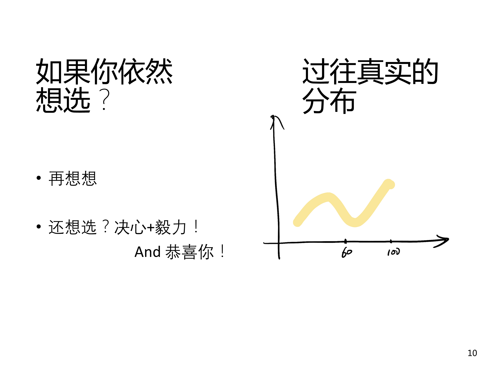

# PA0:开始之前

---

在这里，我们先简要介绍一下后续文档的一些注意事项。

## 你确定要选这门课吗？

（图片来源：[http://www.why.ink:8080/static/slides/ICS2024/01.pdf](http://www.why.ink:8080/static/slides/ICS2024/01.pdf)）

对于《计算机系统基础》这门课的 PA 部分，我们必须交待的一件事是，这门课程的难度和工作量都较大。从往年来看，进行 PA 的同学大概分为以下几种：

1. 失败在 PA0 （即在配环境这一步就已经失败了）。
2. 完成到 PA1 ，这部分同学是能够拿到一定分数的，但是由于完成进度较低，很难通过该课程。
3. 完成到 PA2 ，这部分同学已经拿到大部分的实验分数了，通过课程的希望较大，考虑到理论课期末考试分数占比也很大，节约出后面 PA3-4 的时间在准备考试上，可能也是一个性价比不错的选择。
4. 完成到 PA4 ，能在完成了 PA2 后继续前进的同学，基本也不会止于 PA3 ，而是会选择继续前进到 PA4 ，对于这类同学，课程的通过已经是十拿九稳，可以准备冲击高分了。

这里并不是在批评或赞扬某一类完成度的同学，而是想说，由于《计算机系统基础》课程的必修属性，挂科需要不断重修，其代价是较大的，如果目前自身情况确实不能保证自己能通过课程，不妨缓修，以免影响总绩点。

这门课程的实验确实**比较困难**，如果没有足够好的编程基础和计算系统知识，即使是高年级同学甚至研究生也会遇到很大的困难。但是坚持完成实验的收益也是很大的，在这个实验中，你能够接触 Linux ，了解到很多计算机系统的知识，并手动实现一些功能和机制。这也是个人直接参与管理一个中等大小项目（大概几千行）的机会，是一次宝贵的练习。

如果你已经决定选择这门课，笔者十分欢迎，我会以文档的方式与你一起前行，加油。

## 信息框

我们先对后续可能出现的信息框做一些简要的介绍（同时也是为了防止笔者自己忘记，作为一个提醒）。

!!! note "note 笔记"
    这里会对文档内容进行阶段性的总结。

!!! abstract "abstract 摘要"
    这里会写一些对文档内容的概括性描述。

!!! info "info 信息"
    这里会写一些对文档内容的补充说明。

!!! tip "tip 提示"
    这里会写一些对文档内容的提示，可能是对细节或重点的提示，也可能是实用技巧等拓展内容。

!!! success "success 成功"
    表示实验已经取得阶段性的成功，可以稍作休息，收拾心情，准备继续前进。

!!! question "question 疑问"
    这里会提出一些顺着文档思路得出的疑问，希望读者能给予解答，但不一定必须回答。

!!! warning "warning 警告"
    这里会提出一些可能导致错误的注意事项。

!!! failure "failure 失败"
    这里会提出一些可能导致实验失败的错误。

!!! danger "danger 危险"
    这里会提出一些可能导致实验失败的危险操作，需要读者特别注意。

!!! bug "bug 错误"
    这里会指出一些常见 bug 。

!!! example "example 示例"
    这里会给出一些示例代码或实验结果。

!!! quote "quote 引用"
    这里会引用一些重要的观点或论述。

??? note "可折叠的内容"
    当这些框的内容篇幅较长，或需要读者思考后，再由文档给出参考答案的，会使用折叠的信息框。

!!! note
    !!! tip
        信息框是可以嵌套的。

