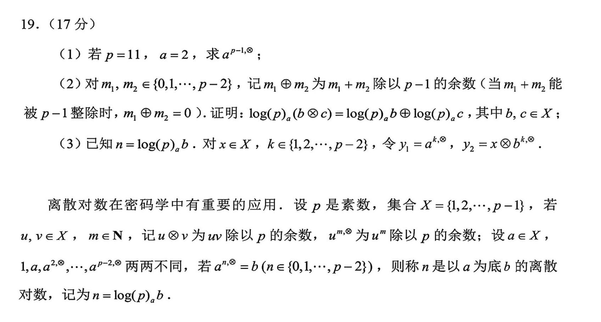

<style>p { text-indent: 2em; }</style>

# 与 AI 交互

!!! abstract "摘要"
    本篇与实验文档中“ Getting Source Code for PAs ”的部分有部分对照，但无直接绑定关系。


---

在[编写宗旨](../guidelines/index.md)中我们提到过， PA 是在 2014 年开发完成的，而在现在的 202x 年代，我们获得了一个强劲的 AI 助手，它可以帮助我们摆脱过去必须读大量手册、搜索社区才能解决一点点小需求的问题。

我们在这篇文档中可以轻松一下，来聊聊如何使用 AI 工具来辅助我们的实验和拓展学习。

## 初级技巧：报错信息解决

想必这个不用教大家都会，我们前面介绍了很多的 Linux 工具，当你的本地机中没有安装这个工具时，终端就会报错：

```shell
$ xxx
xxx: command not found
```

即使你看不懂他在讲什么，你也知道， AI 肯定看得懂，你把这段信息复制给它，它就会教你怎么解决这个问题。

这个技巧也可以推广，比如，当你在配置 CMake 时，你偶尔可能遇到这样的报错：

```cmake
CMake Error at CMakeLists.txt:1 (project):
 ...
```

一大堆的报错信息你肯定懒得看，你如果不知道它的机制，即使看懂了你也不会改，这种时候不如直接问 AI ：

```plaintext
我的 CMakeLists.txt 使用时出现了报错，以下是我的 CMakeLists.txt 和报错信息，请帮我修改，直接给我生成一个新的 CMakeLists.txt 文件。
```
然后你要做的就是复制粘贴了。

继续推广这个技巧，当我们在自己写程序时，也可以借鉴这种思路，在程序中输出足够多的 log 信息，这样 AI 就可以帮我们分析错误原因。比如

```c
int num = 0;
for (int i = 0; i < 10; i++){
    printf("i = %d\n", i);
    for (int j = 0; j < 10; j++){
        printf("j = %d\n", j);
        printf("Before: num = %d\n", num);
        num += i * j;
        printf("After: num = %d\n", num);
    }
}
```

这样的话，如果程序出现了 bug ，就可以把 log 信息复制给 AI ，它就可以知道程序的执行流中各个变量的状态。否则， AI 就只能单纯地靠猜测来检查你的代码哪里有问题了，众所周知， AI 就像在做数学证明题的同学们一样，即使知道自己证的大概率是错的，也会往上面硬写，期盼能蒙对几分。


## 拾遗

在介绍后面更好用的技巧前，我们先给大家铺垫一些预备知识。

下面是一个大家都见过的例子：


（各位现在有在做密码学的同学吗？知道离散对数是什么了吗？）

其实 AI 就是一位答题者，各位现在就是一位出题者。回想一下当年，你们在考试时是根据什么答题的？现在你们来做出题者，就需要相对应做些什么事。

板板正正的卷子和题目大家见得多了，我们玩个小游戏，如果我们把这道题目变成下面的样子放在考场上，你觉得多少高中生能答对？


答案显然，作对的人数无限逼近于 0% 。注意，这道题的题干并没有给出任何的条件，也就是说去掉题干不影响题目的正确性，所以我们只是去掉了一些与题目并非强相关的**知识**内容，如果是一个做密码学的同学来做这道题，那他自然不会感到太大的障碍，因为他在**知识**层面有这些背景内容的记忆。但是，问题在于，这道题目**面对的人**是高中生而不是密码学研究者，对一个高中生的要求里并不包括拥有密码学背景知识，所以题干必须给出这道题中不在高中范围内的密码学知识，不然这道题目就不能达成考察和区分的目的。

当我们要给一名高中生出题时，需要在**高中知识范围内**出题，如果题目涉及到**非高中知识**，则需要在题目中**加入其知识背景**，确保考生在**我们期望的思维能力下**能够做出题目。当我们想要降低题目难度时，**可以提供更多的条件、知识或思路提醒**。

所以同理，我们想给 AI 出题，就要在**知识库范围内**出题，如果题目涉及到**非知识库知识**（如当前项目目标、代码结构、代码内容等），则需要在题目中**加入其知识背景**，确保 AI 在**其推理能力下**能够做出题目。如果 AI 的回答不能让我们满意，我们就需要降低题目难度，**提供更多的条件、知识或思路提醒**。

还有一些小彩蛋，想象一个情境，我们在日常中拿到了这样的一道题：


于是我们询问 AI ：

```plaintext
我是一名高考生，现在拿到了这样的一道题目，请为我提供足够的背景信息，让我有能力在我已有的知识和能力背景下做出这道题目。
```

AI 会怎么回答？你觉得呢？

所以，或许这道题实际是出成这样的：



而几年来我们一直把题目做反了。

总而言之，如何使用 AI ，或许早在高中时期就是一个伏笔，现在是检验大家学习成效的时候了。

## 旅行伙伴加入！

说了这么多，最关键的问题其实就是，对于 AI 来说，对于我们问的每一个具体问题，它的**非知识库知识**是什么，这些就是我们需要补充的内容。

结合前面的[初识 Linux ](./PA0_2.md)部分的内容，我们需要认识更多的新伙伴，他们会在未来的 PA 中大幅助力我们前进。

显然注意到，在完成 PA 的过程中， AI 所不知道的就是：实验要求和项目本身这两样内容（因为你能够上手做 PA ，就是根据这些东西）。所以我们需要给 AI 提供这些内容。

回想你在做语文阅读题时，一篇阅读加上题目长则两三千字，可能还要分析各种图表，如果你给到 AI 的信息只有抠门的二三十个字，基本也可以不用指望它能给出满意的回答了。

如何提供实验要求？这很简单，把实验文档复制进去就行了。

如何提供项目呢？复制粘贴每一个文件就行了。

!!! warning 
    等等，你说什么？你想复制粘贴十几个 .c .h 文件，这也太麻烦了吧！先不说会不会有重漏，万一你哪里做了一点点修改，你又要重新再复制一遍吗？


所以，这个时候就要用到命令行工具了：

```shell
cat **/*.c **/*.h
```

但万一文件太多，还要手动复制全部输出吗？还是太麻烦了。这种时候我们就可以用我们之前学习的管道和重定向。

你可以这样：

```shell
cat **/*.c **/*.h > all_files.txt
```

把所有的文件内容存储在一个文件中，这样 AI 就可以直接读取这个文件了。

当然，偶尔我们不想多管理一个文件，只是想把一个程序的输出复制到剪贴板里去，那该怎么办呢？

!!! tip "Linux 理念"
    当你有某种需求时，大概率就有一个工具可以解决它。

所以现在就是你询问 AI 的时候了。

??? info "一个参考答案"
    利用管道机制，把所有.c 和.h 文件的内容合并到一个文件中，并将其输出到剪贴板：
    ```shell
    cat **/*.c **/*.h | xclip -selection clipboard
    ```
    执行完之后，你就会发现可以直接粘贴所有文件的内容了。
    
现在我们还面临一个问题， AI 可能并不知道我们这些文件是怎么组织的，分成哪些模块，它可能在风马牛不相干的模块中修改了一点代码，导致程序不能正常运行。

所以，我们还需要提供给 AI 我们的项目架构。这又该怎么办呢？（这难道还用我说嘛）

??? info "一个参考答案"
    ```shell
    tree
    ```

把这些内容复制给 AI ，想必就能得到更好的答案了。

但是，虽然我们有了项目架构，文件内容和提供的文件架构之间对应不上，也就是说 AI 并不知道你的项目下的每一个文件对应什么内容，这又该怎么办？

所以，你知道自己应该养成这样一个习惯，在每个代码文件的开头用注释写上这个文件的路径和名称，这样就能够建立起架构到内容的对应关系了。

我们应该建立起这样的习惯，就是每当自己有一个需求，就需要根据需求分析解决方法，由此得到自己应当做什么来解决这个需求，相信这个理念会在未来的道路上一直帮助到大家。

---

能够跟到这里，笔者也该跟你说一句辛苦了，我该感谢你对我撰写的文档质量的信任，虽然限于篇幅，不可能在使用 AI 的方法上面面俱到，如果你有更多使用 AI 的独门秘诀，也欢迎与我分享。
