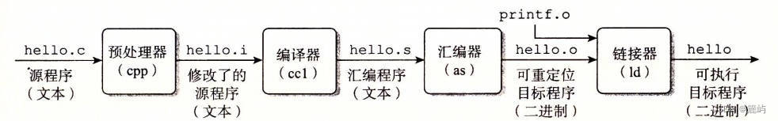
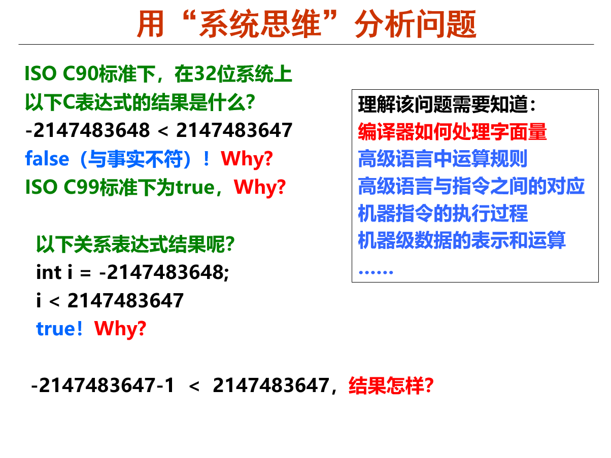

<style>p { text-indent: 2em; }</style>

# 表达式求值：编译器与软件测试

本节手册与计算机系统中的“基础软件”（编译器）一层有关。

```plaintext
----------
用户程序
----------
基础软件     编译器  ←  nemu 表达式求值
----------
操作系统
----------
硬件指令集
----------
```

!!! abstract "摘要"
    本篇文档将简要介绍编译器相关的知识。

!!! success "你已经学会了编译器，可以继续前进了……吗？"
    这一节介绍编译器，但并不涉及实验的核心内容，所以这一部分可以不看，或者简单过一遍就好，放轻松，慢慢来~

---

## 初识编译器

编译器是将一份代码转化成机器语言的的程序，以便让机器可以运行我们写的程序。一般来说，我们日常所说的编译实际上是从高级语言到汇编语言的过程（因为从汇编到机器语言只需要简单地翻译指令，不存在什么难度）。



这张图片大家应该都已经在各个课程中见过，编译器实际上就对应 .i 文件到 .s 文件的过程。

我们这里设计一个小实验，供大家直观感受从 .c 文件到 .s 文件的过程。

我们先编写一个 C 程序 `example.c` ：

```c
#include <stdio.h>
#define MAX_NUM 100

int main() {
    int a = 10;
    int b = 20;
    int sum = a + b;
    
    printf("The sum of %d and %d is: %d\n", a, b, sum);
    printf("Maximum number is: %d\n", MAX_NUM);
    
    return 0;
}
```

然后将其转化成 .i 文件：

```shell
gcc -E example.c -o example.i
```

`-E` 选项表示只进行预处理，不进行编译。

然后我们可以用 vim 查看 `example.i` 文件的内容。

然后我们再将 .i 文件转化成 .s 文件：

```shell
gcc -S example.i -o example.s
```

`-S` 选项表示只进行汇编，不进行链接。

仔细观察这些文件中的内容，尝试寻找原来的 .c 文件的各个部分（如宏、函数、变量、字符串）在一步步转化的过程中都去了哪里。

!!! tip "偷懒的办法"
    你可以直接把生成的这几个文件的内容拷贝给 AI ，让它来分析并给出答案。

你也可以创建一个 Makefile 来自动化这个过程，就当一个 Makefile 的小练习：

```makefile
# 定义编译器
CC = gcc

# 定义目标文件
TARGET = example

all: preprocess compile assemble

preprocess:
	$(CC) -E $(TARGET).c -o $(TARGET).i

compile:
	$(CC) -S $(TARGET).c -o $(TARGET).s

assemble:
	$(CC) -c $(TARGET).c -o $(TARGET).o

clean:
	rm -f $(TARGET).i $(TARGET).s $(TARGET).o $(TARGET)

.PHONY: all preprocess compile assemble clean
```

## 从表达式求值中看编译的流程

从我们上面的讲解可以看出，编译的本质其实就是把一个字符串变成另一个字符串，两个字符串表达的是一样的信息，只是以不同的形式面向不同的对象。（那我这个写文档的何尝不也是一种编译器）

### 词法分析

我们上面所说的“字符串”，若要表达一定的信息，那它肯定不能随意书写（随意到像离散里学的笛卡尔积一样）。只有**符合某种规则**的字符串，才能表达我们想要的意思。

!!! question "我看到文档上都在说什么词素什么 token ，这都是什么东西？"
    不要紧张，术语是很难懂，但这不重要，跟着我慢慢来，了解原理才是重点。

下面我们举一个例子，说明编译器的运作过程。

假设我们要识别一个英文句子。句子如下：

```plaintext
This is 大 apple.
```

首先，我们都知道，英文是以一个个用空格分隔的单词作为小单位的，每一个单词可以表示为 26 个英文字母的排列组合（用正则表达式就是 `[A-Za-z]+` ）。而一个英文句子里是不可能出现中文的，所以这个句子显然是有问题的。从字符串中找出一个个小单位（单词）的过程就叫**词法分析**，找出的一个个小单位称为词素（ `Token` ）。如果在词法分析过程中出现了错误，说明字符串中存在不属于这个语言的元素（用数学语言讲，就是不属于语言的全集）。

### 语法分析

好的，我们经过了词法分析，发现了一些小问题，并进行了修改，现在这个句子变成了这样：

```plaintext
This is big apple.
```

看起来正常许多了，我们进入下一步：语法分析。

通过了词法分析的字符串，包含了一个个合法的单词，但并不是单词随便组合就能形成一个有实际含义的句子的。一个句子必须**满足一定的语法规则**才能表达一个完整的意思，我们称检查句子是否符合语法规则的过程为**语法分析**。

我们对上面的句子进行分析，发现 `apple` 前面缺少了冠词，不符合语法，所以我们进行修改。

```plaintext
This is a big apple.
```

### 语义分析

好了，我们通过前面的词法分析和语法分析两步，已经确保这个句子是一个符合英语规则的句子，接下来就可以分析其含义，进入语义分析了。这个句子的含义显然，我们就不分析了。

!!! info "语法语义一轮完成"
    在很多情况下，语义分析会在语法分析的同时直接完成，因为语法分析的过程会建立句子的语法结构，可以直接根据逐步生成的语法结构去理解语义。因为语义分析过程中不会出现报错，所以如果在这个过程中出现错误，一定是语法分析没通过，那直接丢弃已经进行了的语义分析结果即可。 PA 中的表达式求值就是一个语法语义一轮完成的过程（不断寻找主运算符的过程，同时也在进行递归计算）。


## 软件测试及 AI 脚本的力量

我们如何测试我们写好了的表达式求值程序？

我们可以在脑子里想十几个表达式，然后一次次输入到 nemu 中，然后用肉眼比对结果是否正确。

但是，全自动化的测试对我们而言更有诱惑性，对，简单来说，就是自动生成表达式，自动运行 nemu 得到结果，同时自己自动计算求解，比较两个结果是否相同。

刚开始你肯定会觉得，自动生成表达式不是多此一举吗？本来只需要测试一个程序，现在等于是又多了一个程序需要写，既浪费时间，还不一定能写对。

是这样的，自动化测试和你使用 Linux 一样，都是前期学习进度慢，后期则可以大大加快开发效率的东西，只要努力克服这个前期的惰性，你就能收获一个效率远超人类千百倍的测试助手。

!!! tip "来试试吧"
    写一个全自动测试的程序，实际上就是在一个测试程序中运行被测试程序，然后检查结果。这看起来很难，但在现在的 AI 加持下，已经不再是难题，你只需要把你的程序的运行方式、输入方式、测试检查方式整理好告诉 AI ，它就能自动为你生成一个测试程序！你可以自由选择程序的语言， C 、 python 、 java 等都可以，重点在于自动化测试而不是语言。

    就像我在前面说过很多遍的，不要紧张，一步步尝试着去做就好。用程序去运行程序，得到的效果就是程序的平方，当你写出一个正确的脚本程序的时候，你会为你的成果而感到自豪！

    你并不需要生成一个完美的实现，一些小的 bug 是可以被允许的，我们后面会提到测试存在的局限性，你只需要得到一个能够进行基本的判断比对结果的程序即可。

    我们提供了一个[参考实现](../files/test-expr.py)，你可以先玩一玩，然后尝试自己让 AI 写一个，并检查这两个实现有什么不同。（注意，参考实现为了方便，从 nemu 的输出中寻找结果时是寻找“Result = 0x...”开头的行，使用这个脚本时请务必注意这一点，调整好自己的 nemu 实现的输出格式）

!!! note "程序设计的意义"
    各位有没有问过自己一个问题：我们为什么设计程序？

    我们使用程序是因为它能比人类高效快速得多地解决一个问题，设计程序的过程就是一个投资过程，投资存在风险（程序写错了/花费了时间精力），但当你积累了足够多的成功经验后，你就能够依据过去的经验来行动，稳稳地获得收获。

    我们都知道，学校里有许许多多的通修程序设计课，但鲜有人最终在通修程序设计中得到其精髓，而只是得其皮毛，混了个分数。

    程序设计的强大之处在于：它能将结构性的操作自动化，让我们从繁琐的重复性工作中解放出来，让我们专注于更有价值的工作。

    比如，处理 excel 表格等结构化数据，就可以使用程序来自动化处理，节省大量的时间。当别人在苦苦地一点点复制粘贴时，你只需要跟 AI 说一句话得到一个程序<del>，就能跟领导假装说这个问题任务量很大要搞几个小时，然后获得大量的时间摸鱼</del>。


## 表达式求值测试在 unsigned 的缺陷

如果你已经尝试使用了我们提供的参考实现，并且找出了一些表达式求值的 bug ，那么能帮到你我感到很开心，但是再往后你就会发现一些问题：即使你的表达式求值已经通过了 OJ 上的所有测试，但是对于有些输入，总是会在测试程序里显示错误。

这是因为我们在表达式求值的过程中，全部都在用 unsigned 类型运算，而 python ，包括 C 语言中在进行相应数的表达式求值时，会默认将这些常量按照 int 类型处理，导致一旦出现负数乘除法之类的情况，最后得到的结果可能是和 unsigned 运算不同的。

C 语言对值的默认处理应该会让你回想起《计算机系统基础》课上的这张 PPT 。



