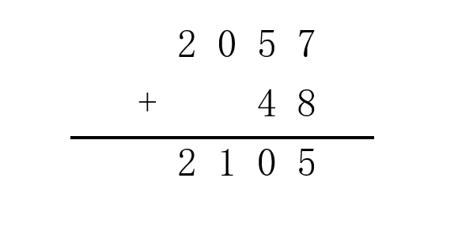
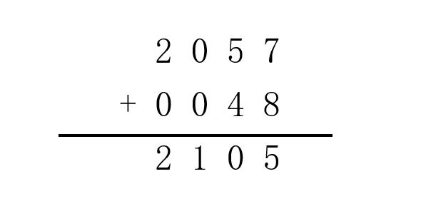
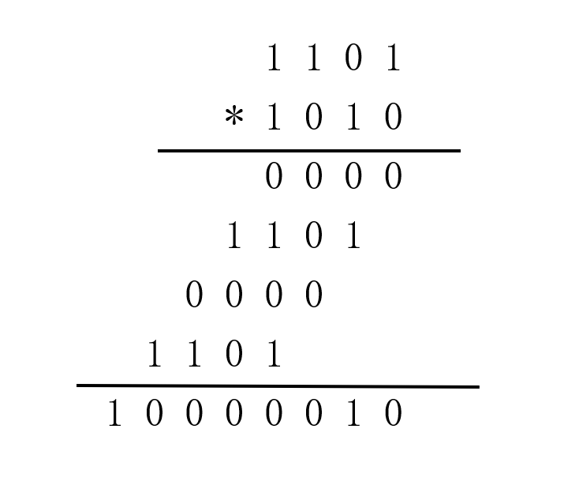
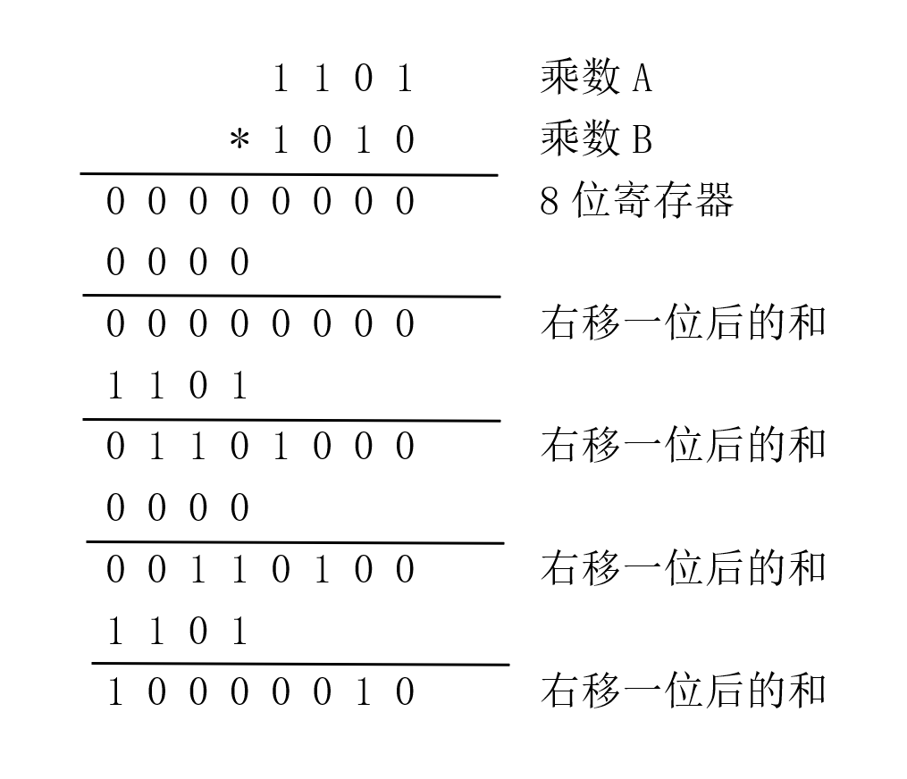
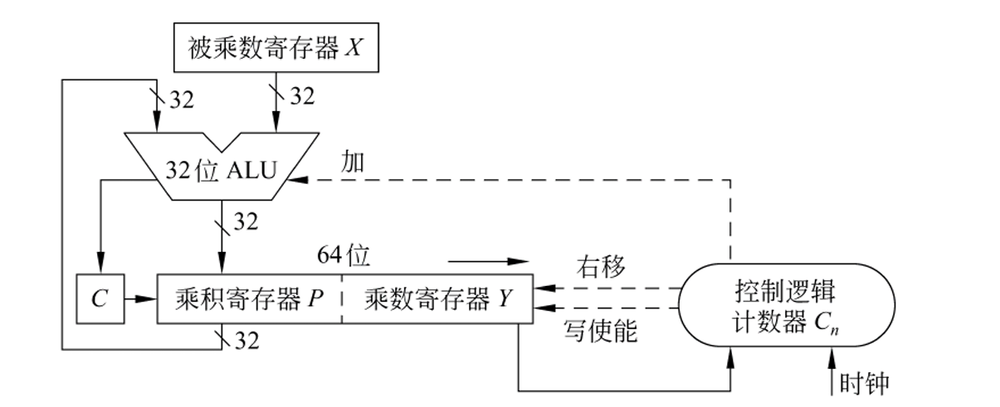
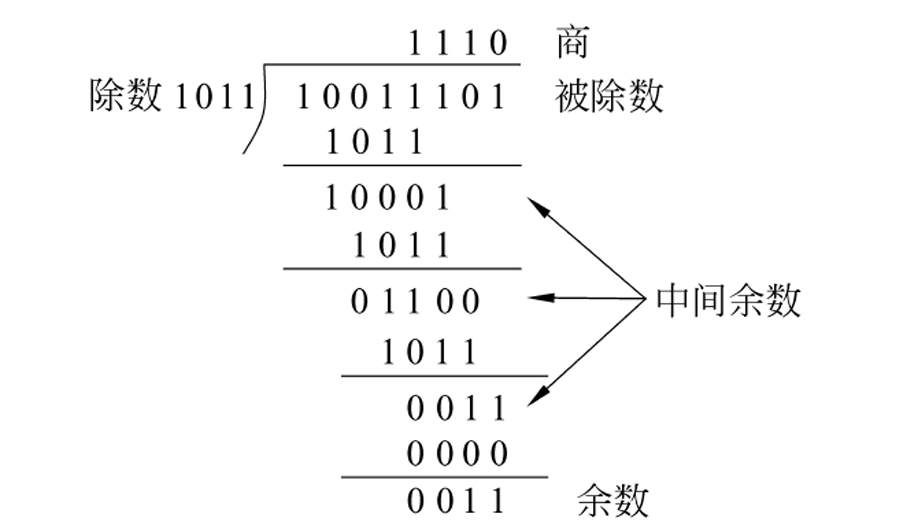
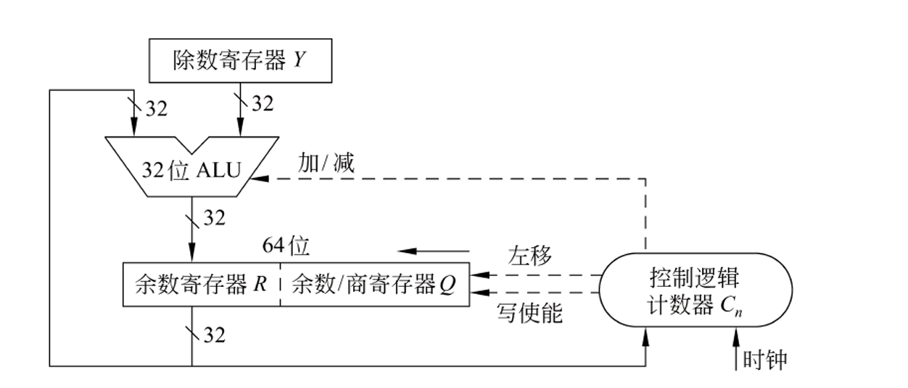
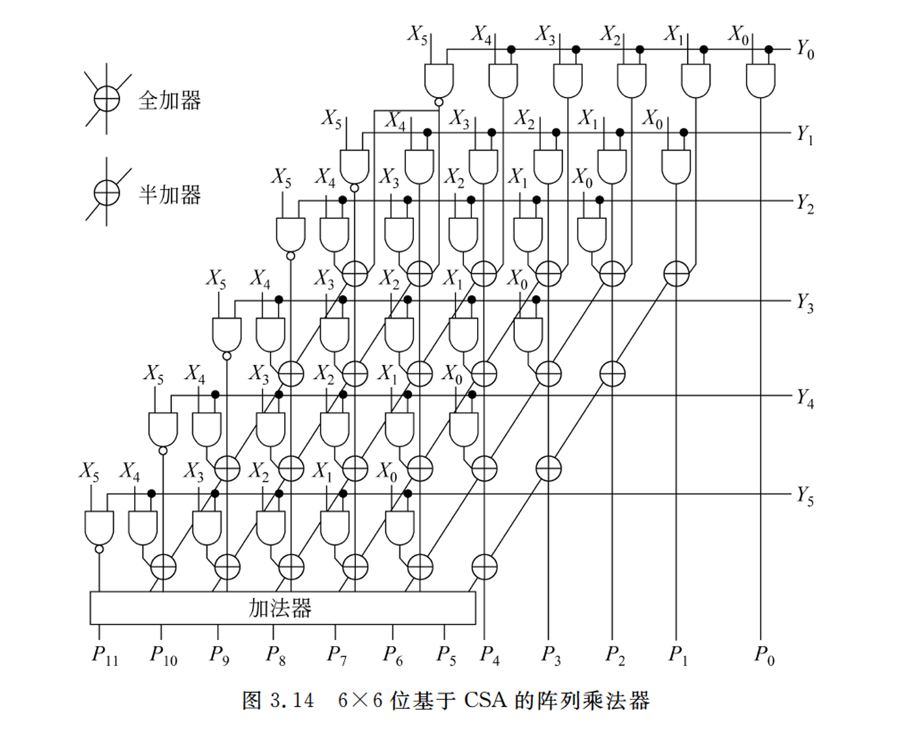

<style>p { text-indent: 2em; }</style>

# Lab1：大整数运算

!!! failure "悲报"
    笔者完全看不懂实验文档在写什么，所以根本写不出这次 lab 。

!!! success "要来玩点大的吗？"
    既然看不懂实验文档，那就我们自己重写一份实验文档吧！

---

!!! info "注意"
    本实验文档内容也是完成大整数运算，但内容组织和实验方法与原文档完全不同，读者可选择任意一个文档完成此次实验，也可两边相互对照，加深思考。


## 1. 实验背景

你已经在《计算机系统基础》课程中学过了整数的机器级表示，在 C 语言中，我们常用的整数是 32 位 和 64 位整数，你无法实现“无穷无尽”的整数扩展，但是在 Python 语言中，你可以轻松实现一个大整数运算：

```python
a = 12345678901234567890
b = 9876543210
c = a * b
print(c)
```

而不需要担忧整数类型表示能力的限制。

你一定好奇这是怎么实现的。在这次实验中，你有机会实现一个简化版的大整数运算，将 64 位无符号整数运算扩展到 128 位无符号整数。在实现了这一步的扩展后，任意位的整数运算想必也不是不可能的了。

## 2. 实验内容

见[原实验文档](http://www.why.ink:8080/ICS/2024/labs/Lab1)

## 3. 实验指南

我们将会使用模拟硬件乘/除法器的方式完成这次实验。

对于硬件而言，在不经过任何优化的条件下，任意两个整数进行同一个运算所需的电路门时间是一样的，无论它们值的或大或小。这是因为此时硬件并不关心整数的大小，而只是将它们作为一串二进制数据作完全相同的处理。

比如加法，你可以类比我们手算时的加法，比如对于四位数加法：



对于机器而言，它其实长这样：



机器并不在乎整数实际上有几位，它只是机械地将两个整数位数对齐，按位相加，处理进位，仅此而已。我们人类自己自然会省略无意义的前导零，但机器不会。

### 3.1 乘法

显然，两个 64 位整数相乘的结果是一个 128 位整数。我们在此以简化的 4 位无符号二进制整数相乘为例，来展示如何实现无符号数乘法。

先来看看手算竖式乘法，对于一个乘数 A 乘一个乘数 B ：



对手算来说似乎很简单，只要按位相乘，各值相加，处理进位即可。对于一个机器实现，我们可以做一个 8 位的寄存器作为临时积，每次根据乘数 B 对应位为 1 还是 0 ，选择是否加上一次乘数 A ，加完所有的 4 位即得结果。

但是，对于硬件而言，每次 ALU 执行加法都需要载入一个 4 位的数，一个 8 位的寄存器，每个连续 4 位都需要执行一次加法，这样在电路上的实现是很不方便的，我们希望，每次都是 8 位寄存器中固定的 4 位被取出，然后送到 ALU 中去做加法。

所以，我们采用了一个全新的思路，将一个乘数的不同位与另一乘数相乘时产生的“移位”转移到积中去。



当然，由于是 4 位整数相乘，如果结果也需要表示成 4 位整数的形式，我们就需要采取截断操作，只取后 4 位整数。但在这次实验中，我们可以用模拟的数据结构保留完整的大整数。

实际操作中可以更节省电路和逻辑，将乘数 B 直接预先存入 8 位寄存器的后 4 位中，这样可以通过每次右移后直接判断 8 位寄存器末位来决定此次是否要加上一次乘数 A 。而在 8 位寄存器末 4 位中的乘数 B 会在右移 4 次后被“挤出” 8 位寄存器，所以并不会影响结果的正确性。

所以，我们的 8 位寄存器本质可以理解成两个 4 位寄存器，前 4 位是一个加法寄存器，后 4 位用作辅助存储乘数 B 和临时结果。

根据这样的思路，我们就能完成 64 位无符号整数乘法。以下是课本中给出的硬件 32 位整数乘法示例。


（图片来自《计算机组成与系统结构》（袁春风主编））

### 3.2 除法

模运算本质就是除法运算，除法运算的结果包含商和余数，只不过模运算取的结果是余数而不是商而已。

如果你已经充分理解了上文乘法运算的原理，那么无符号数除法可能对你来说可能会更简单。

以下是来自课本的一个手算除法例子，供各位回忆如何进行手算除法。


（图片来自《计算机组成与系统结构》（袁春风主编））

我们开始介绍无符号整数除法的实现。由于数据结构的限制，我们的被除数和除数需要长度相同（如果不同，则扩展到相同位数再进行运算），我们此处以 4 位整数除以 4 位整数为例。

参考手算除法，我们可以知道除法的本质，就是把除数从高位不断减到低位，期间不断积累商的各个位，最后被除数剩下的不够减的部分就是余数。

参考乘法，我们也需要将移位的操作从除数“转嫁”给被除数。我们同样建立一个 8 位寄存器，将被除数存入低 4 位中，高四位置 0 。然后每次将 8 位寄存器左移一位，并判断此时的高四位部分是否够减除数，如果够减，商的对应位则置 1 ，并在 ALU 中进行减法操作，用结果更新高四位（对应手算除法的“中间余数”），积累给下次移位；如果不够减，则商对应位置 0 ，不进行减操作。

对上述操作重复四次后，我们就得到了四位的商，原 8 位寄存器的高四位就是被除数剩下的“不够减”的部分，对应到数学概念中，也就是余数。

我们也可以参考乘法中节省空间的操作，将商上到 8 位寄存器的最低位中，在移位四次的过程中，它并不会影响结果的正确性。当我们需要商时，直接可以从低 4 位中取出，我们就实现了一次运算同时获得商和余数。

此时，我们的 8 位寄存器同样可以视作两个 4 位寄存器，高四位为余数，低四位为商。

参考所给的思路，我们就能完成 128 位无符号整数的除法。


（图片来自《计算机组成与系统结构》（袁春风主编））


### 3.3 测试指南

对于测试，最直接的办法自然是直接拿一个可以认为正确的大整数运算实现来和你的 C 函数内容进行对比。最方便的之一就是 Python 。

原实验手册教你可以直接输出内容，用肉眼进行比较，但你完全可以将比较的任务交给机器来完成。你可以询问 AI ，让它帮你写一个 Python 程序，这个程序中有三个整数，将这三个整数作为 C 可执行文件的输入，然后将 C 程序的输出和 Python 程序的计算结果进行对比。

你甚至还可以利用我们之前讲过的管道和重定向机制，再写一个 C 程序，遍历输出三个 64 位整数，不断管道给 Python 程序作为输入去计算，当遇到不匹配的结果时，打印出这个错误样例，这样你就再也不用被得到 Wrong Answer 但找不到错误的样例而烦恼。让机器进行自动化的测试肯定比人工一个个测既快速又靠谱。

对于你之前错过的样例，你肯定更加熟悉如何调 Bug ，那你也完全可以将所有错过的样例存在一个文件里，然后利用重定向机制或者文件操作来进行回归测试，这样如果后续的修改影响了前面已通过样例的正确性，通过熟悉的样例你也能更快定位错误。

这上面的有些内容你看不懂，不理解很正常，也没有关系，你完全也可以把上面这段内容复制给 AI ，并提供给它你的项目代码和结构，让它根据我的阐述，给你解释其中你不懂的内容，带着你一步步进行操作。


## 4. 拓展

### 4.1 有符号乘除法

本次实验中我们完成的是无符号数乘除法，但如果实验来到了有符号数的环境中，我们又该如何搭建电路完成计算？

有符号数计算可以完全基于无符号数。对于乘法来说，只需要把有符号数转化成对应的正数，然后计算得到的结果根据两个乘数的符号情况确定符号即可。感兴趣的同学也可以研究使用了巧妙的数学变换，使得效率更高的布斯乘法。

除法则较为麻烦，因为被除数、除数符号的不同，会影响余数符号的定义，进而影响商的值，但其本质和无符号整数除法是类似的，也就是不断尝试用除数去加/减被除数，使得被除数不断接近 0 ，然后得到商和余数。感兴趣的同学可以去了解补码恢复余数除法和补码不恢复余数除法。

### 4.2 正确性与效率问题

如果只是想实现一个正确的大整数运算，我们显然有一个十分简单的思路：用一个 64 位整数存放临时值（假设为 `tmp` ），建立一个循环，循环 `a` 次，每次执行 `tmp = tmp + b;` ，然后判断 `tmp` 和 `m` 的大小关系，如果大于等于，则需执行 `tmp = tmp - m;` 。（当然，这甚至是一个思路，实际上你需要很小心地处理溢出情况。）

但是，这样运算的时间代价是巨大的。假设 `a` 等于 2^64 ，那就需要循环 2^64 次，随位数的增加（假设为 n 位整数），最坏时间复杂度就是 O(2^n) ，这样的指数时间代价是难以承受的。

单纯的“理论可计算”并不能满足我们的需求，在现实应用中，我们必须寻找更高效的算法。我们在上文中使用的移位算法可以将复杂度优化到 O(n) ，在实际应用中，我们还可以通过比如**使用硬件搭建电路，将一次运算的移位提升到 4 位、 6 位、 8 位等**来进一步减少乘法消耗的时间。



感兴趣的同学还可以进一步了解华莱士树，它将不同位数的部分积同时相加，这样的话每次可以减少一半的部分积数量，直至最后剩余两个部分积相加得到结果，复杂度可以继续优化到 O(log n) 。

### 4.3 Python 的实现

显然，虽然 Python 支持大整数运算，但机器底层并不存在那么大的整数，感兴趣的同学可以搜索 Python 在底层是如何存储这些大整数的。对于大整数这类数据运算的效率问题，当然还是根据数学原理进行优化的效果最爽，可以尝试了解 Karatsuba 算法和 FFT 乘法。