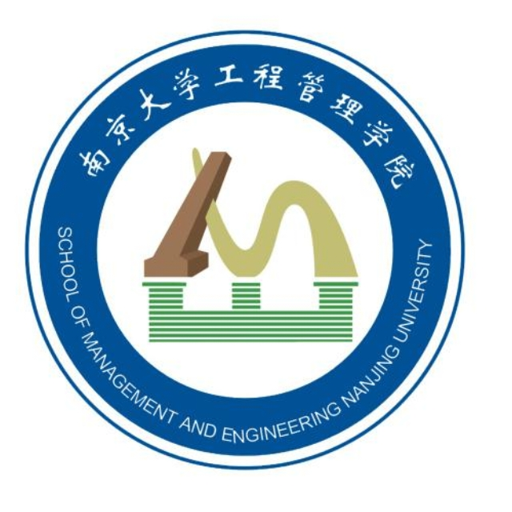

# 转工管群 Wiki

!!! quoto "工程管理学院院训"
    学道酬实，至任于群

转工管群旨在为有意向了解、分流、转专业进入工程管理学院、机器人与自动化学院的同学提供信息咨询服务与支持，为在工程管理学院、机器人与自动化学院的同学提供信息交流平台。

{:height="40%" width="40%"}

转工管群github页面由转工管群信息支持保障与空间网络安全组（Information Support Guarantee and Space Network Security Group）维护，在2025年7月23日创立，网址为`smewin.github.io`。

!!! question "为什么这个网页如此简陋？"
    尽管我们给小组起了一个听起来很高级的名字，但是实际上我们能力十分有限。这是一个非官方的学生群组，成员数量不多，且主修专业可能不与计算机强相关，因此我们无法提供太多技术支持。不过我们会尽量做好，为转工管群提供信息支持服务。

!!! question "工管是什么？"
    让我们开始吧。

    [工程管理学院官网](https://sme.nju.edu.cn/ "访问SME官网")

    [在这里了解工管](./sme_intro/intro.md "工程管理学院简介")

!!! tip "如何加入转工管群"
    请加入QQ群：920882951

[贡献者参考手册](./sme_intro/contributors.md)

[网站日志](./log/log.md)

---

转工管群 信息支持保障与空间网络安全组