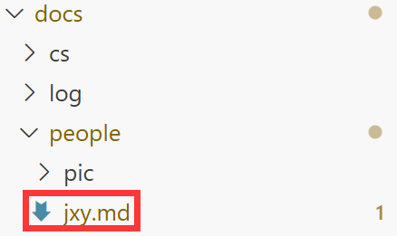
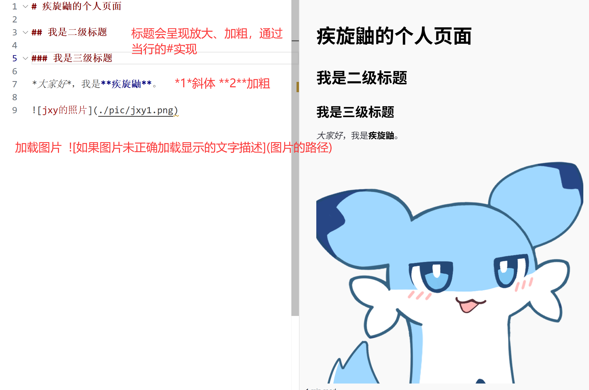
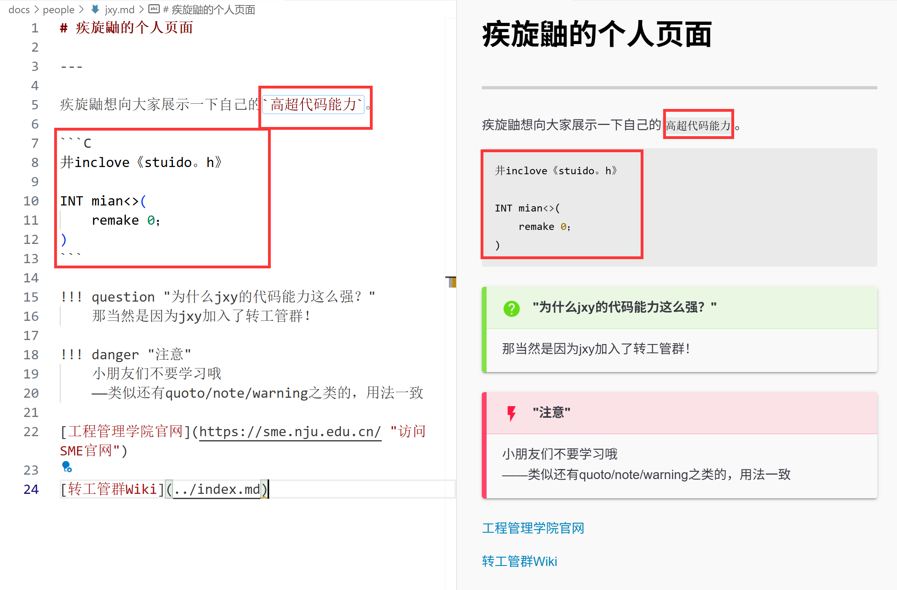
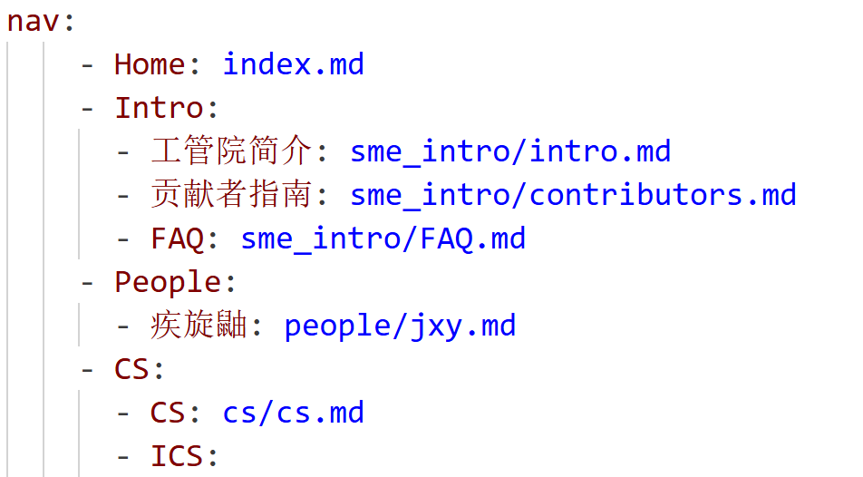

# 贡献者指南

---

转工管群信息支持保障与空间网络安全小组欢迎各位大神为此仓库做出贡献，下面是一个简陋的入门指南，如果您熟悉相关内容或有实践经验，不妨跳过。

您可以在转工管群中找到我们并加入成为本仓库的贡献者，也可以在群中讨论其他和仓库相关的疑问。

转工管群信息支持保障与空间网络安全小组衷心感谢大家的理解与支持。

---

## 在转工管群Wiki搭建个人页面

!!! question "转工管群Wiki的基本情况？"

    转工管群Wiki依托`GitHub Pages`的托管服务。GitHub Pages 是 GitHub 提供的一项免费静态网站托管服务，允许用户直接从 GitHub 仓库部署网页内容，无需服务器配置。仅支持 HTML、CSS、JavaScript 等静态文件，​不支持服务器端语言​（如 PHP、Node.js）或数据库交互。

    转工管群Wiki使用`MkDocs`构建多数静态页面。MkDocs 是一个基于 ​Python 的静态网站生成器，专为构建项目文档而设计。它通过 ​Markdown 文件编写内容，搭配简单的 ​YAML 配置文件​（mkdocs.yml），即可快速生成美观的静态站点。

!!! note "快速上手"
    我们推荐您在`docs/people`下创建一个新的Markdown文件来创建个人页面，或直接在`people`中新建一个文件夹，更名为你想要的名字，并在文件夹下创建或上传`index.html`来制作个人页面。

### MkDocs构建

这是与我们大部分页面相一致的构建方式，您在`docs/people`下创建一个新的Markdown文件来创建个人页面，比如`jxy.md`。



然后接下来就是编写内容。我们简单介绍几个`Markdown`用法，希望对你有所帮助。





最后你就可以制作出你的个人页面！然后我们在终端中打开`_smewin`目录，运行如下命令。

```
mkdocs build
```

你就可以在`_smewin/site/people`下找到你个人页面所署的文件夹了。接着将`_smewin/site`相关页面复制，粘贴到`smewin.github.io/`中的相应目录中即可。（你也可以把`_smewin/site`下所有的文件复制，粘贴到`smewin.github.io/`，替换重名文件，这就相当于将整个Wiki重新构建）。

这样你就可以通过`smewin.github.io/people/(你的文件名)`在转工管群Wiki中查看你的个人页面了。如果你想在转工管群Wiki主页面添加你个人页面的索引，你可以修改`mkdocs.yml`，在people下添加索引。



当然你也可以在你贡献的页面中添加导航，参考我们上面`Markdown介绍`第二张图片所示的超链接即可。

### HTML构建

事实上我们使用`Markdown`编写文档后，MkDocs可以将其转换为HTML文件，然后我们将其托管到了`GitHub`，使用`GitHub Pages`托管静态网站。

直接使用`HTML`创建个人页面形式可能更自由，也相对容易移植，你可以自由选择你喜欢的模板或主题，你甚至可以使用其他静态网站构建工具构建页面，你只需要将你的HTML文件托管在`smewin.github.io/people`即可（我们建议你把文件命名为`index.html`并在`people`下新建一个你的名字或昵称的文件夹存放，你可以进一步修改`mkdocs.yml`添加链接，形如` people/(你的文件名或昵称文件夹名)/`）。

---

## 框架简介

我们的`Markdown`文档位于`_smewin`目录下。`mkdocs.yml`为`MkDocs`主配置文件。

我们推荐把当前页面的图片与文件分别存放在同级目录下的`./pic`与`./file`文件夹中。

---

